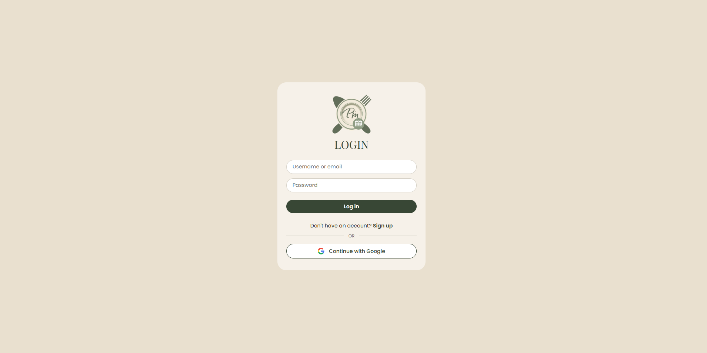
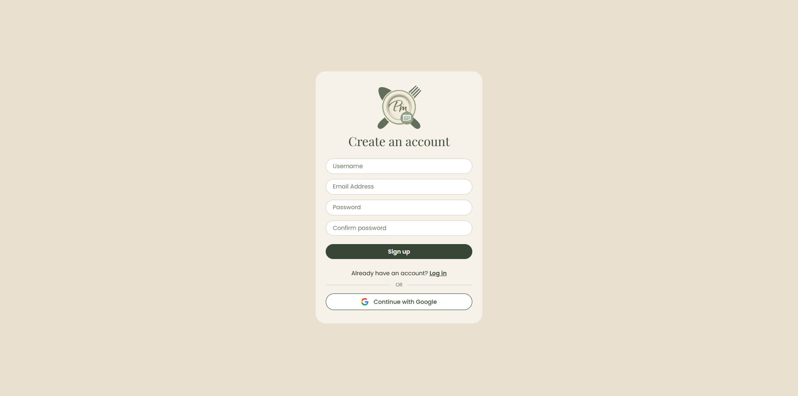
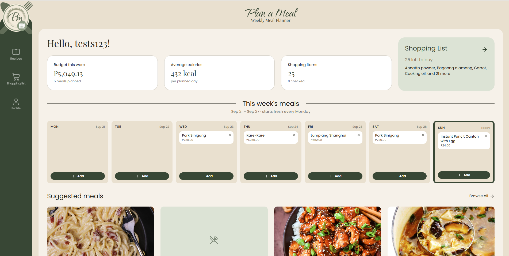
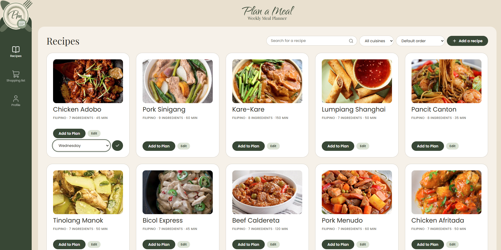
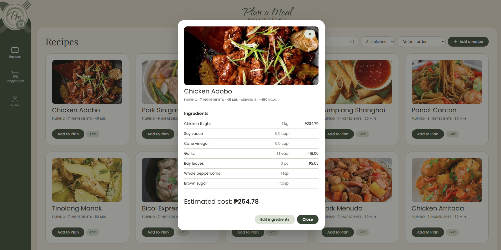
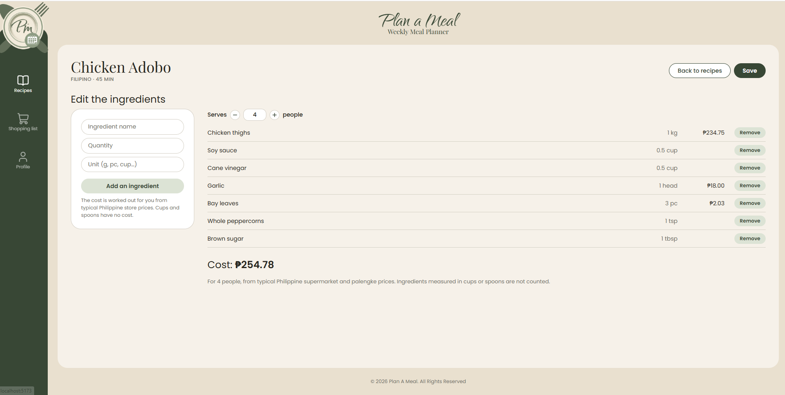
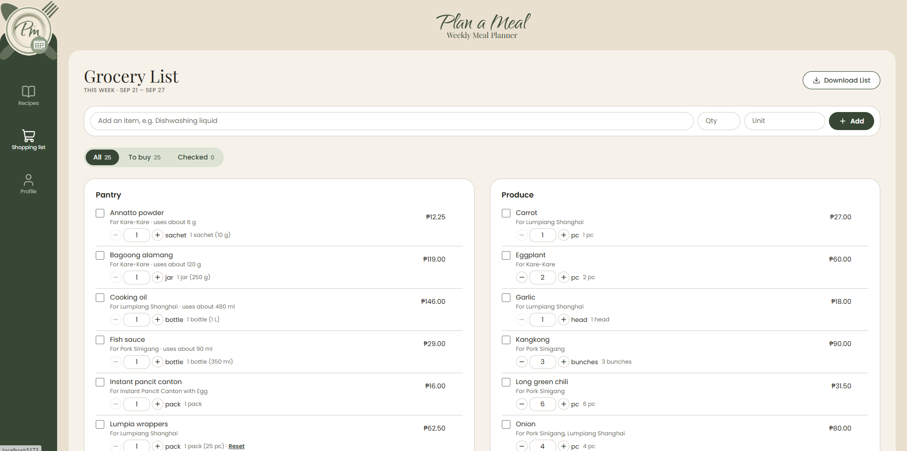
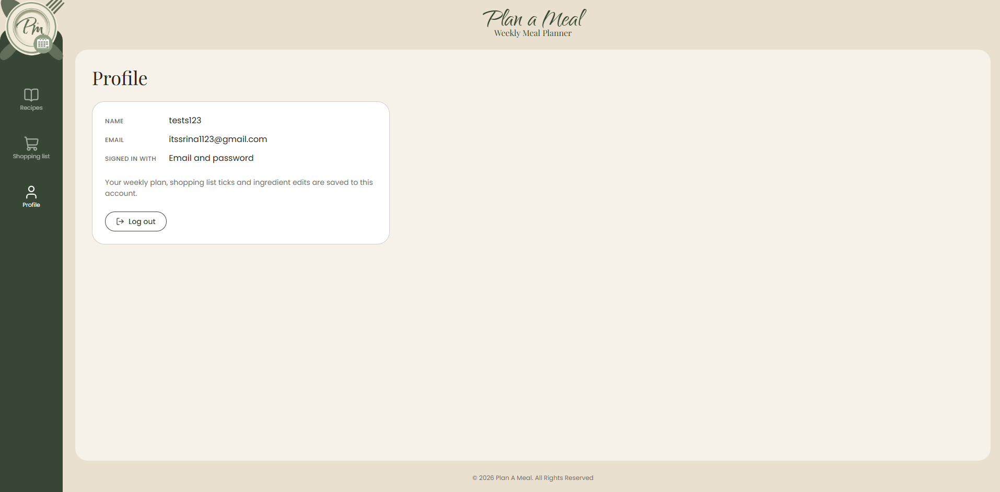

# Plan A Meal: Weekly Meal Planner

**Live site:** https://yourusername.github.io/your-repo-name/

**API:** https://your-api.onrender.com/healthz

**Demo video:** (https://drive.google.com/file/d/1BF1ayvgUcFD1uIKioJUWvwHAKqE33---/view?usp=sharing)

## **1\. Overview**

Plan a Meal lets someone assign recipes to the days of the week and automatically builds the grocery shopping list those meals require. This web is for those people who want an easier way to plan meals and grocery list. In the moment they open it, they're trying to choose recipes for the days ahead, and they won't have to worry about listing the ingredients themselves.

## **2\. Setup and installation**

1. Clone the code git clone https://github.com/sheena-magpantay/plan_a_meal.git
   cd plan_a_meal/client
2. Install dependencies
   npm install
   npm install lucide-react
   npm install react-router-dom
4. **Environment variables:** copy `.env.example` to `.env` 
5. **Database:** in your Supabase project, open the SQL Editor, paste all of
   `supabase/schema.sql` and click **Run**. 

## **3\. How to run it**

To run the frontend code, enter cd src and then npm run dev in the terminal. 

## **4\. Features and usage**

1. Log in or create an account.  
2. After logging in, the user sees the week: three cards (budget this week, average calories, and shopping items), a Shopping List preview panel, all seven days of the week with whatever is already assigned, and suggested meals below.  
3. Browse or search for a recipe. Clicking Recipes in the sidebar (or a suggested meal, or “Browse all”) . Opens the Recipes screen, which shows searchable recipes, each showing the recipe’s name, a thumbnail, and two actions: Add to Plan and Edit.  
4. Assign a recipe to a day. Tapping Add to Plan opens an inline “Choose a Day” dropdown right on that card. Picking a day and confirming with the checkmark assigns the recipe.  
5. Tapping Edit on any recipe card opens Recipe Ingredients. The screen has the full ingredient list (name, quantity, estimated cost), an “Add an ingredient” form, and a running cost total. Saving here is what keeps the shopping list accurate later.  
6. After that, the user can see the updated shopping list. Once a few days have recipes assigned, the Shopping List screen auto-generates a recipe list from everything assigned that week, grouped into categories (Pantry, Protein, Dairy, etc.) with a checkbox per item, a running quantity and total cost, and a “Download List” button for taking it to the store. 
7. The weekly meal plan will reset after the week is finished.

## **5\. Project structure**

```
plan_a_meal/
├── .github/workflows/      
├── client/                
│   ├── src/
│   │   ├── api/            
│   │   │   ├── ai.js           
│   │   │   ├── httpApi.js      
│   │   │   ├── index.js      
│   │   │   ├── mockApi.js      
│   │   │   └── supabaseApi.js  
│   │   ├── assets/         
│   │   ├── components/
│   │   │   └── RecipeImage.jsx
│   │   ├── screens/        
│   │   ├── App.jsx        
│   │   ├── auth.jsx        
│   │   ├── categories.js   
│   │   ├── format.js       
│   │   ├── main.jsx        
│   │   ├── pricing.js      
│   │   ├── shopping.js     
│   │   ├── sidebar.jsx     
│   │   ├── styles.css
│   │   ├── supabase.js     
│   │   └── week.js         
│   ├── .env.example
│   ├── index.html
│   ├── package.json
│   └── vite.config.js
├── docs/                   
├── server/                 
│   ├── db/
│   │   ├── pool.js           
│   │   ├── recipes.js        
│   │   ├── run.js            
│   │   ├── schema.sql        
│   │   ├── seed.js           
│   │   ├── shoppingList.js   
│   │   └── storeProducts.js  
│   ├── .env.example
│   ├── Dockerfile
│   ├── package.json
│   ├── recipesRepo.js      
│   └── server.js           
├── supabase/
│   └── schema.sql          
├── .env.example
├── .gitignore
├── AI-USAGE.md
├── compose.yml             
├── LICENSE
├── README.md
└── START-HERE.md
```
            
## **6\. Screenshots**

**Week 2 progress:**  










## **7\. Known issues and next steps**

The known issue is that the integrated Gemini API frequently shows an error saying it is busy and to try again later when it suggests a recipe. I have to fix it this week so that it will run smoothly. I also need to improve the user interface of the other screens, specifically the email integration. 


## AI usage

The AI usage is in this link: 
https://github.com/sheena-magpantay/plan_a_meal/blob/main/AI-USAGE.md

## License

MIT, see [LICENSE](LICENSE).
